# ゼロから再構築ガイド（完全版）

このドキュメントは、現行の出退勤システムを**0から同等仕様で再構築**するための単一ソースです。  
実装の責務、画面構造、データモデル、ルーティング、処理フロー、セキュリティ、運用手順までを網羅します。

---

## 1. システム全体像

### 1.1 コンテキスト図

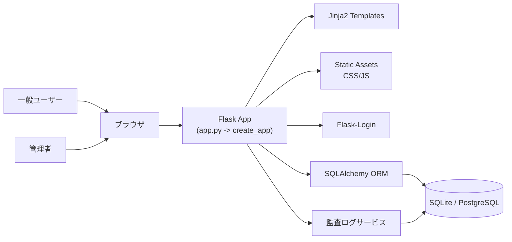

### 1.2 レイヤー構成

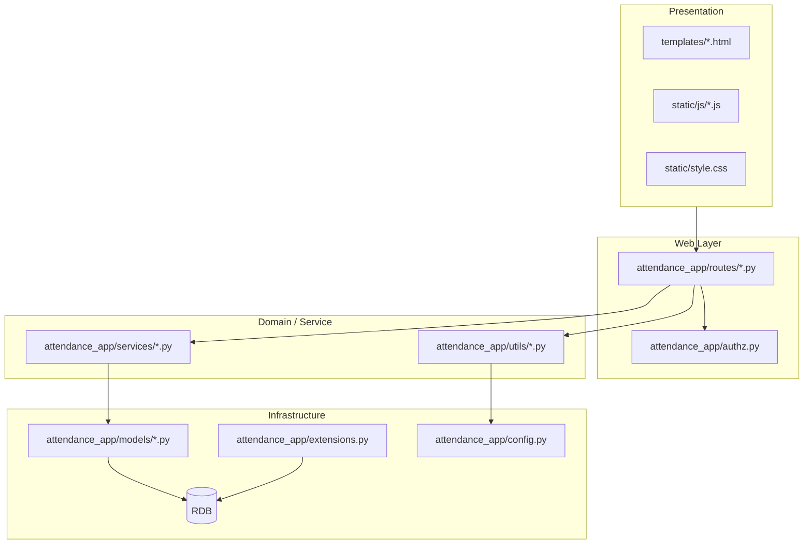

---

## 2. リポジトリ構成（再構築対象）

```text
syukin-system/
├── app.py                                # WSGIエントリ / 互換公開API
├── attendance_app/
│   ├── __init__.py                       # create_app()
│   ├── config.py                         # 環境変数・設定値
│   ├── extensions.py                     # db / login_manager
│   ├── authz.py                          # 管理者認可
│   ├── cli.py                            # flask init-db
│   ├── models/
│   │   ├── user.py
│   │   ├── shift.py
│   │   ├── breaks.py
│   │   └── audit_log.py
│   ├── routes/
│   │   ├── auth.py
│   │   ├── attendance.py
│   │   ├── admin.py
│   │   ├── audit.py
│   │   └── health.py
│   ├── services/
│   │   ├── admin_service.py
│   │   ├── audit_service.py
│   │   ├── csv_service.py
│   │   └── shift_service.py
│   └── utils/
│       ├── security.py
│       ├── datetime_utils.py
│       ├── request_meta.py
│       └── validators.py
├── templates/
│   ├── layout.html
│   ├── login.html
│   ├── dashboard.html
│   ├── admin.html
│   ├── admin_users.html
│   ├── admin_audit.html
│   ├── shift_edit.html
│   └── partials/
│       ├── admin_filters.html
│       ├── admin_shift_create.html
│       ├── admin_daily_totals.html
│       ├── admin_shift_table.html
│       ├── admin_shift_modal.html
│       └── confirm_modal.html
├── static/
│   ├── style.css
│   └── js/
│       ├── admin_shift_modal.js
│       ├── admin_confirm_modal.js
│       └── admin_users_modal.js
├── migrations/                           # Alembic骨組みのみ（versions空）
├── requirements.txt
├── requirements-test.txt
├── pytest.ini
├── pyproject.toml
├── Procfile
└── docs/
```

---

## 3. 起動シーケンス

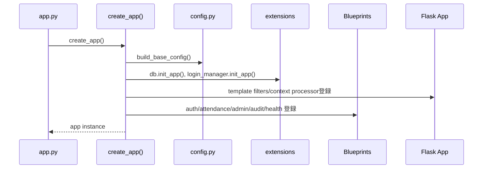

---

## 4. データモデル（DB仕様）

### 4.1 ER図

```mermaid
erDiagram
    USERS ||--o{ SHIFTS : "user_id"
    SHIFTS ||--o{ BREAKS : "shift_id"
    USERS ||--o{ AUDIT_LOGS : "user_id(nullable)"

    USERS {
      int id PK
      string username UNIQUE
      string password_hash
      string email UNIQUE NULL
      string name NULL
      string picture NULL
      string role
      datetime created_at
      datetime last_login_at NULL
    }

    SHIFTS {
      int id PK
      int user_id FK
      datetime clock_in_at
      datetime clock_out_at NULL
      string clock_in_ip NULL
      string clock_in_ua NULL
      string clock_out_ip NULL
      string clock_out_ua NULL
      datetime created_at
    }

    BREAKS {
      int id PK
      int shift_id FK
      datetime start_at
      datetime end_at NULL
      string start_ip NULL
      string start_ua NULL
      string end_ip NULL
      string end_ua NULL
    }

    AUDIT_LOGS {
      int id PK
      int user_id FK NULL
      string action
      string target_type NULL
      int target_id NULL
      string ip NULL
      string user_agent NULL
      text metadata_json NULL
      datetime created_at
      string signature NULL
    }
```

### 4.2 重要制約

- `users.username` 一意
- `users.email` 一意（NULL許可）
- `shifts` は `clock_out_at IS NULL` の行が `user_id` ごとに最大1件（部分ユニーク）
- `breaks` は `end_at IS NULL` の行が `shift_id` ごとに最大1件（部分ユニーク）
- `audit_logs.user_id` は `users` 削除時に `SET NULL`

### 4.3 勤務状態の状態遷移

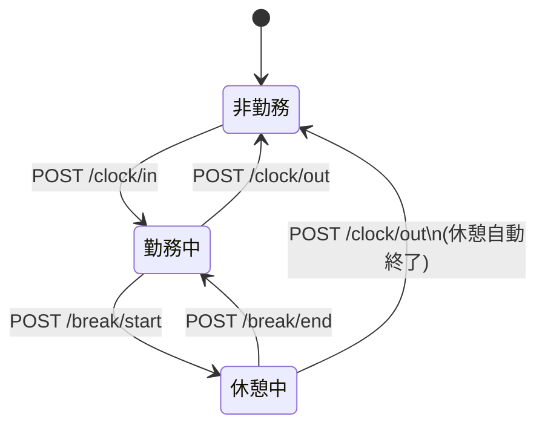

---

## 5. ルーティング完全一覧

| 区分 | Method | Path | 認証 | 権限 | 主処理 | 応答 |
|---|---|---|---|---|---|---|
| Auth | GET/POST | `/login` | 不要 | - | ログイン | HTML/Redirect |
| Auth | POST | `/logout` | 必須 | - | ログアウト | Redirect |
| Attendance | GET | `/`, `/dashboard` | 必須 | - | ダッシュボード表示 | HTML |
| Attendance | POST | `/clock/in` | 必須 | - | 出勤開始 | Redirect |
| Attendance | POST | `/clock/out` | 必須 | - | 退勤（開休憩自動終了） | Redirect |
| Attendance | POST | `/break/start` | 必須 | - | 休憩開始 | Redirect |
| Attendance | POST | `/break/end` | 必須 | - | 休憩終了 | Redirect |
| Admin | GET | `/admin`, `/admin/` | 必須 | admin | 集計/一覧表示 | HTML |
| Admin | POST | `/admin/shift/create` | 必須 | admin | 手動シフト追加 | Redirect |
| Admin | POST | `/admin/shift/<id>/delete` | 必須 | admin | シフト削除 | Redirect |
| Admin | GET | `/admin/export` | 必須 | admin | 勤怠CSV出力 | CSV |
| Admin | GET/POST | `/admin/shift/<id>/edit` | 必須 | admin | シフト/休憩編集 | HTML/Redirect |
| Admin | GET | `/admin/shift/<id>` | 必須 | admin | モーダル用詳細JSON | JSON |
| Admin | GET/POST | `/admin/users` | 必須 | admin | ユーザー管理 | HTML/Redirect |
| Audit | GET | `/admin/audit` | 必須 | admin | 監査ログ閲覧 | HTML |
| Audit | GET | `/admin/audit/export` | 必須 | admin | 監査ログCSV出力 | CSV |
| Health | GET | `/healthz` | 不要 | - | ヘルスチェック | text `"ok"` |

### 5.1 ルートマップ図

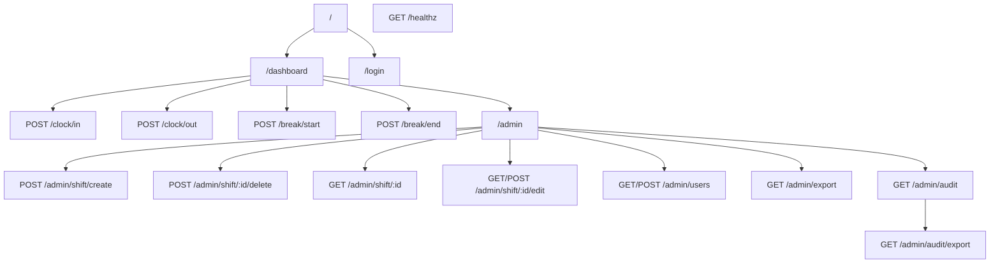

---

## 6. 画面構成と遷移

### 6.1 画面遷移図

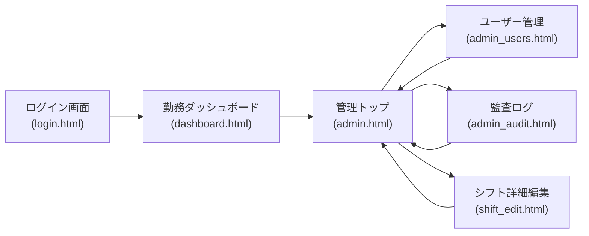

### 6.2 画面責務

- `layout.html`
  - ナビゲーション、スキップリンク、フラッシュ通知、共通CSS/JS読み込み
- `login.html`
  - ID/パスワード/remember_me
- `dashboard.html`
  - 出退勤/休憩操作、最近打刻、管理者向けサマリー
- `admin.html`
  - 管理機能ハブ（検索、作成、集計、シフト一覧）
- `admin_users.html`
  - ユーザーCRUD（編集は単一モーダル再利用）
- `admin_audit.html`
  - 監査ログ検索・可視化・CSV出力
- `shift_edit.html`
  - シフト詳細編集、休憩CRUD、休憩リセット

---

## 7. フロントエンド契約（フォーム/JSON）

### 7.1 主要フォーム入力名

| 画面 | Action | 必須フィールド |
|---|---|---|
| ログイン | `POST /login` | `username`, `password`, `csrf_token`, `remember_me?` |
| ログアウト | `POST /logout` | `csrf_token` |
| 出勤 | `POST /clock/in` | `csrf_token` |
| 退勤 | `POST /clock/out` | `csrf_token` |
| 休憩開始 | `POST /break/start` | `csrf_token` |
| 休憩終了 | `POST /break/end` | `csrf_token` |
| 管理検索 | `GET /admin` | `start?`, `end?`, `username?` |
| 管理追加 | `POST /admin/shift/create` | `user_id`, `clock_in_at`, `clock_out_at?`, `csrf_token` |
| シフト削除 | `POST /admin/shift/<id>/delete` | `csrf_token`, `start?`, `end?`, `username?` |
| シフト更新 | `POST /admin/shift/<id>/edit` | `action=update_shift`, `clock_in_at`, `clock_out_at?`, `csrf_token` |
| 休憩追加 | `POST /admin/shift/<id>/edit` | `action=break_add`, `start_at`, `end_at?`, `csrf_token` |
| 休憩更新 | `POST /admin/shift/<id>/edit` | `action=break_update`, `break_id`, `start_at`, `end_at?`, `csrf_token` |
| 休憩削除 | `POST /admin/shift/<id>/edit` | `action=break_delete`, `break_id`, `csrf_token` |
| 休憩リセット | `POST /admin/shift/<id>/edit` | `action=break_reset`, `csrf_token` |
| ユーザー作成 | `POST /admin/users` | `action=create`, `username`, `password`, `role`, `csrf_token` |
| ユーザー更新 | `POST /admin/users` | `action=update`, `user_id`, `name`, `email`, `role`, `password?`, `csrf_token` |
| ユーザー削除 | `POST /admin/users` | `action=delete`, `user_id`, `csrf_token` |

### 7.2 シフト詳細API（モーダル用）

`GET /admin/shift/<id>` は以下キーを返す:

- `id`
- `user_username`, `user_email`, `user_name`
- `clock_in_at`, `clock_out_at`（表示用）
- `clock_in_form`, `clock_out_form`（`datetime-local` 用）
- `clock_in_utc`, `clock_out_utc`
- `clock_in_ip`, `clock_out_ip`
- `worked_seconds`, `worked_hms`
- `break_count`, `break_seconds`, `break_hms`

---

## 8. 重要処理シーケンス

### 8.1 ログイン

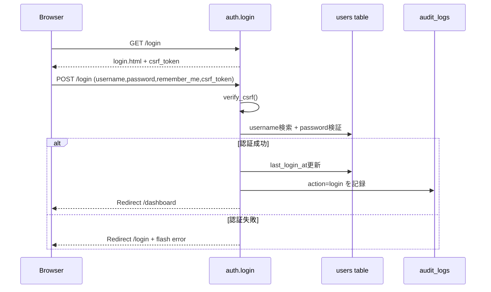

### 8.2 出勤

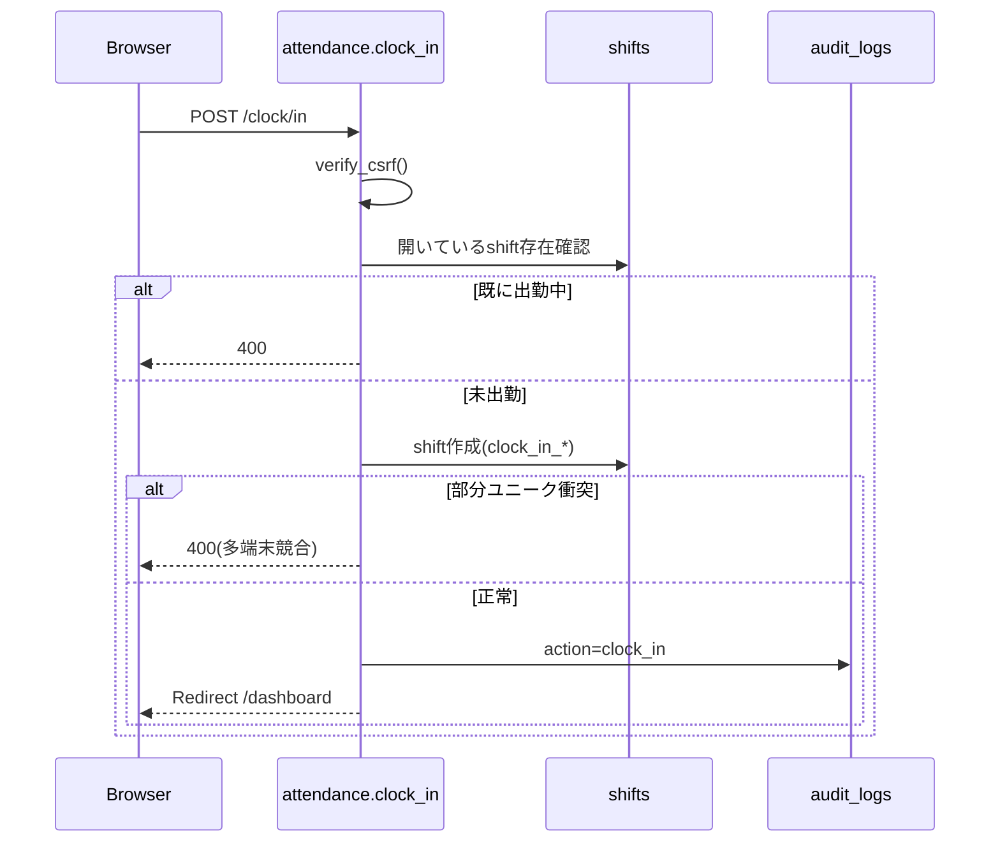

### 8.3 退勤（開休憩の自動終了あり）

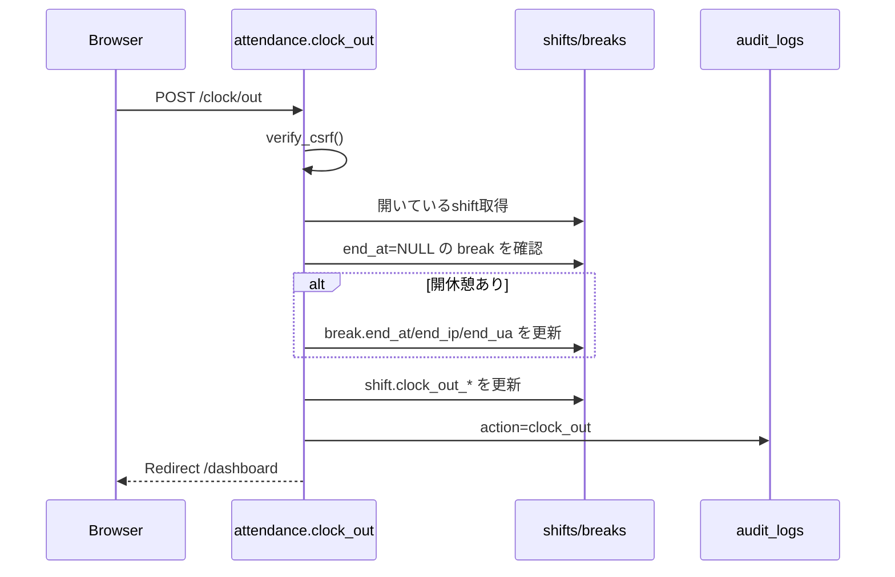

### 8.4 管理者シフト編集モーダル

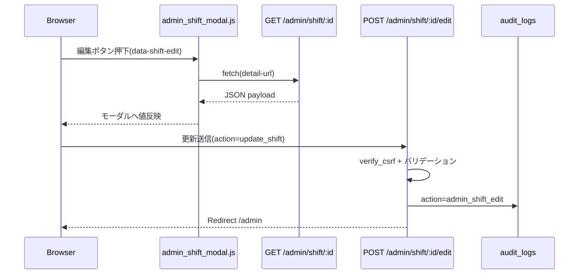

### 8.5 破壊的操作の2段階確認

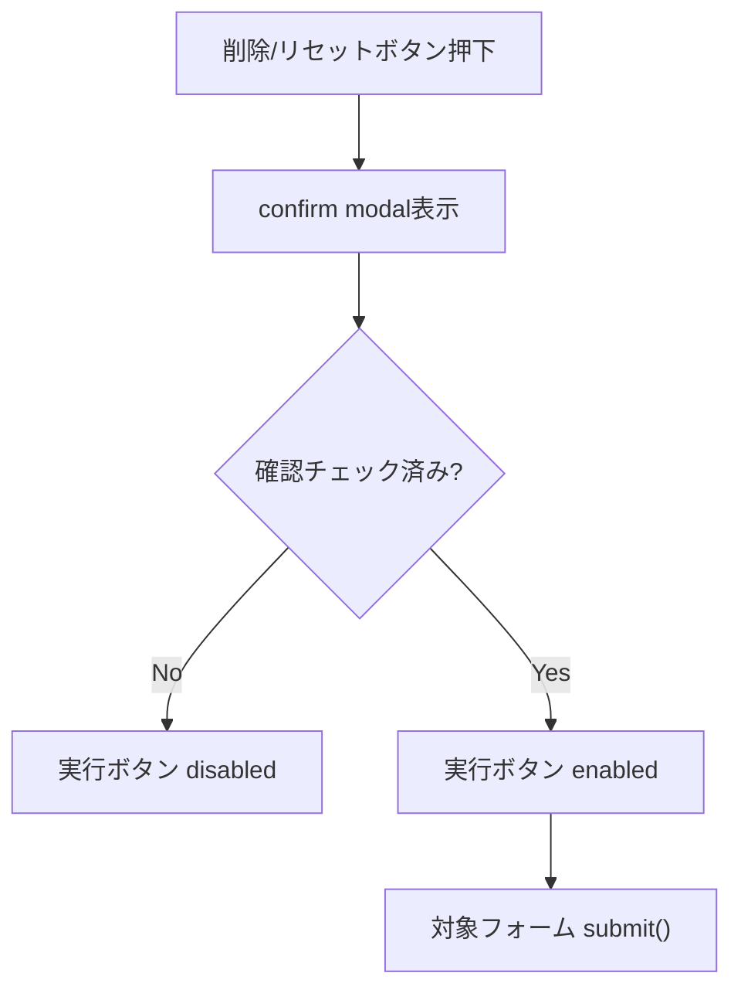

---

## 9. セキュリティ設計

### 9.1 セキュリティ要素

- 認証: Flask-Login（`login_user`, `logout_user`, `@login_required`）
- 認可: `require_admin()` で管理機能を保護
- CSRF: `ensure_csrf()` と `verify_csrf()`（hidden token照合）
- 監査証跡: 全重要操作で `log_audit(...)`
- 監査署名: `sign_payload()` による HMAC-SHA256 署名
- Cookie:
  - `SESSION_COOKIE_HTTPONLY=True`
  - `SESSION_COOKIE_SAMESITE=Lax`
  - `SESSION_COOKIE_SECURE` は環境変数制御
  - remember cookieも同様に制御

### 9.2 監査ログの署名データ

署名元文字列:

`{action}|{target_type}|{target_id}|{metadata_json}`

`SECRET_KEY` で HMAC-SHA256 を算出して `audit_logs.signature` に保存。

---

## 10. CSV仕様

### 10.1 勤怠CSV（`/admin/export`）

ヘッダー:

- `user_username`
- `user_email`
- `user_name`
- `shift_id`
- `clock_in_local`, `clock_out_local`
- `worked_seconds`, `worked_hms`
- `clock_in_utc`, `clock_out_utc`
- `clock_in_ip`, `clock_out_ip`
- `clock_in_ua`, `clock_out_ua`
- `break_count`
- `breaks_total_seconds`, `breaks_total_hms`

### 10.2 監査CSV（`/admin/audit/export`）

ヘッダー:

- `created_at_local`, `created_at_utc`
- `action`
- `user_username`, `user_email`, `user_name`
- `target_type`, `target_id`
- `ip`, `user_agent`
- `metadata_json`
- `signature`

---

## 11. 環境変数仕様

| 変数名 | 必須 | デフォルト | 説明 |
|---|---|---|---|
| `SECRET_KEY` | 推奨必須 | ランダム生成 | セッション/署名キー |
| `DATABASE_URL` | 任意 | `sqlite:///attendance.db` | DB接続URL |
| `TIMEZONE` | 任意 | `Asia/Tokyo` | 表示タイムゾーン |
| `CSV_EXPORT_MAX_DAYS` | 任意 | `365` | 期間検索最大日数 |
| `SESSION_COOKIE_SECURE` | 任意 | `false` | HTTPS時は`true` |
| `REMEMBER_COOKIE_DAYS` | 任意 | `14` | ログイン保持日数 |
| `REMEMBER_COOKIE_SECURE` | 任意 | `SESSION_COOKIE_SECURE`準拠 | remember cookieのSecure設定 |

---

## 12. 0から再構築する実装順序

### Phase 1: ベース

1. `attendance_app` パッケージ作成
2. `create_app()` と `app.py` を用意
3. `extensions.py` で `db`, `login_manager` を定義
4. `config.py` で環境変数設定を実装

### Phase 2: モデル

1. `User`, `Shift`, `Break`, `AuditLog` を実装
2. 部分ユニークインデックス（開シフト/開休憩）を実装
3. `Shift.worked_seconds()` / `total_break_seconds()` を実装

### Phase 3: ユーティリティ/サービス

1. 日時変換とフォーマッタ (`datetime_utils.py`)
2. CSRF/HMAC (`security.py`)
3. 監査記録 (`audit_service.py`)
4. 管理集計/CSV (`admin_service.py`, `csv_service.py`)

### Phase 4: ルーティング

1. `auth`, `attendance`, `admin`, `audit`, `health` の順に実装
2. 全POSTでCSRF検証、管理系で `require_admin()`
3. 重要操作に `log_audit()`

### Phase 5: UI

1. `layout.html` で共通構造（skip/main/flash/nav）
2. 各画面テンプレート実装
3. partials とJSモーダルの連携を実装
4. `static/style.css` でレスポンシブ（desktop/mobile切替）

### Phase 6: 運用基盤

1. `flask init-db` CLI
2. `Procfile` (`web: gunicorn app:app`)
3. `.env.example` と README
4. Alembic骨組み（必要に応じて差分運用）

---

## 13. セットアップ手順（コピペ可）

```bash
python -m venv .venv
# Windows
.\.venv\Scripts\activate

pip install -r requirements-test.txt
flask --app app init-db
flask --app app run -p 8000
```

初期管理者作成:

```python
from app import app, db, User

with app.app_context():
    admin = User.query.filter_by(username="admin").first()
    if not admin:
        admin = User(username="admin", role="admin", name="管理者", email="admin@example.com")
        db.session.add(admin)
    admin.set_password("change-me")
    db.session.commit()
```

---

## 14. テスト戦略（同等再現確認）

### 14.1 実行コマンド

```bash
python -m pytest
python -m ruff check .
```

### 14.2 必須検証シナリオ

- 認証:
  - 正常ログイン、異常ログイン、ログアウト
- 打刻:
  - 出勤→休憩開始→休憩終了→退勤
  - 出勤重複/休憩重複の競合
- 管理:
  - シフト作成/編集/削除
  - 休憩追加/更新/削除/リセット
  - ユーザー作成/更新/削除（自己削除禁止）
- 監査:
  - 各操作で監査ログが残ること
  - CSV出力の列整合
- UI:
  - キーボード遷移、確認モーダル、モバイル表示切替、横スクロール無

---

## 15. デプロイ構成

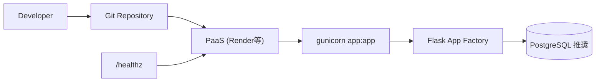

運用時の推奨:

- `SECRET_KEY` を必ず固定値で管理
- 本番で `SESSION_COOKIE_SECURE=true`
- `DATABASE_URL` はPostgreSQLを使用
- `CSV_EXPORT_MAX_DAYS` を業務要件に応じ制限

---

## 16. 実装同等性チェックリスト（最終）

- [ ] DBテーブル4種と制約が一致している
- [ ] ルート一覧（章5）が全て実装済み
- [ ] フォーム名/JSONキー（章7）が一致している
- [ ] 監査ログが全重要操作で記録される
- [ ] HMAC署名が `audit_logs.signature` に保存される
- [ ] 画面遷移が章6の通り動作する
- [ ] CSV列が章10の仕様と一致する
- [ ] テストが全件パスする

---

## 17. 補足

- 既存 `docs/01`〜`docs/13` は機能別の詳細説明。
- 本書は「再構築用の統合版」であり、実装時は本書を主参照にして問題ありません。

